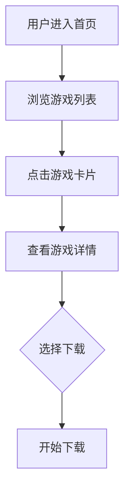

## 1. 产品概述
手机端游戏下载网站，专为游戏爱好者设计，提供游戏资源下载、CG图集浏览等功能。目标用户为手机端用户，提供简洁易用的界面和丰富的游戏资源。

## 2. 核心功能

### 2.1 用户角色
| 角色 | 注册方式 | 核心权限 |
|------|----------|----------|
| 普通用户 | 无需注册 | 浏览、下载游戏 |
| 注册用户 | 邮箱/手机 | 下载、收藏、评论 |

### 2.2 功能模块
1. **首页**: 顶部搜索、轮播图、功能入口、游戏列表
2. **侧边菜单**: 分类导航、PC游戏、游戏CG、图集资源
3. **游戏详情页**: 游戏介绍、下载链接、相关推荐

### 2.3 页面详情
| 页面名称 | 模块名称 | 功能描述 |
|----------|----------|----------|
| 首页 | 顶部导航 | 搜索框、网站logo、用户中心入口 |
| 首页 | 功能区 | 网站公告、秒传脚本、Gal悦音阁、补档记录 |
| 首页 | 游戏列表 | 游戏卡片展示、封面图、名称、简介 |
| 首页 | 底部导航 | 首页、补档、签到、搜索、菜单、我的 |
| 侧边菜单 | 分类导航 | PC游戏、游戏CG、图集资源、新人必读 |

## 3. 核心流程
用户进入首页 → 浏览游戏列表 → 点击游戏查看详情 → 选择下载

## 4. 用户界面设计

### 4.1 设计风格
- 主色调: #FF6B6B (珊瑚红)
- 辅助色: #4ECDC4 (薄荷绿)
- 按钮样式: 圆角、渐变背景
- 字体: 微软雅黑/苹方
- 布局: 卡片式、移动端优先
- 图标: 线条风格、简约

### 4.2 页面设计概述
| 页面名称 | 模块名称 | UI元素 |
|----------|----------|--------|
| 首页 | 顶部导航 | 搜索框、logo、用户图标 |
| 首页 | 功能区 | 4个圆形图标按钮 |
| 首页 | 游戏列表 | 瀑布流卡片布局 |
| 首页 | 底部导航 | 6个图标+文字按钮 |
| 侧边菜单 | 菜单列表 | 列表项带图标，展开箭头 |

### 4.3 响应式设计
- 移动端优先设计
- 触摸优化
- 适配不同屏幕尺寸

### 4.4 3D场景指南
本项目不适用。