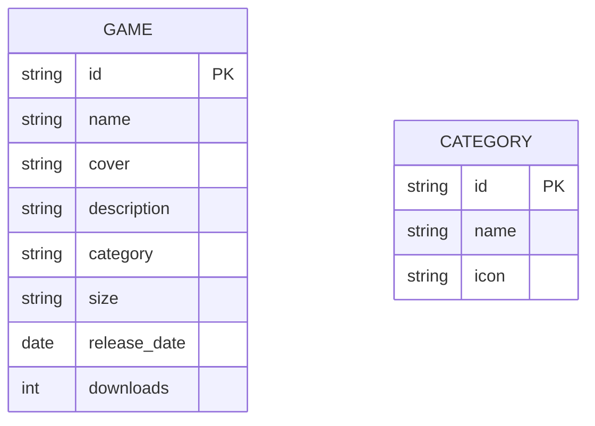

## 1. 架构设计
```mermaid
layeredGraph LR
    subgraph 前端
        A[Vue组件]
        B[Tailwind CSS]
        C[Vue Router]
    end
    
    subgraph 数据
        D[模拟数据]
    end
    
    A --> D
    B --> A
    C --> A
```

## 2. 技术描述
- 前端: Vue@3 + tailwindcss@3 + vite
- 初始化工具: vite-init
- 后端: 无（静态模拟数据）
- 数据库: 不需要

## 3. 路由定义
| 路由 | 用途 |
|------|------|
| / | 首页游戏列表 |
| /game/:id | 游戏详情页 |
| /category/:type | 分类页面 |

## 4. API定义
静态模拟数据，不需要API。

## 5. 服务器架构图
不适用（静态网站）。

## 6. 数据模型

### 6.1 数据模型定义


### 6.2 数据定义语言
```sql
-- 游戏表（模拟数据）
INSERT INTO games (id, name, cover, description, category, size, release_date, downloads) VALUES
('1', '游戏名称1', 'cover1.jpg', '游戏简介1', 'PC游戏', '2.5GB', '2024-01-15', 12500),
('2', '游戏名称2', 'cover2.jpg', '游戏简介2', 'PC游戏', '3.2GB', '2024-02-20', 8900);

-- 分类表（模拟数据）
INSERT INTO categories (id, name, icon) VALUES
('1', 'PC游戏', 'gamepad'),
('2', '游戏CG', 'image'),
('3', '图集资源', 'images'),
('4', '新人必读', 'book-open');
```